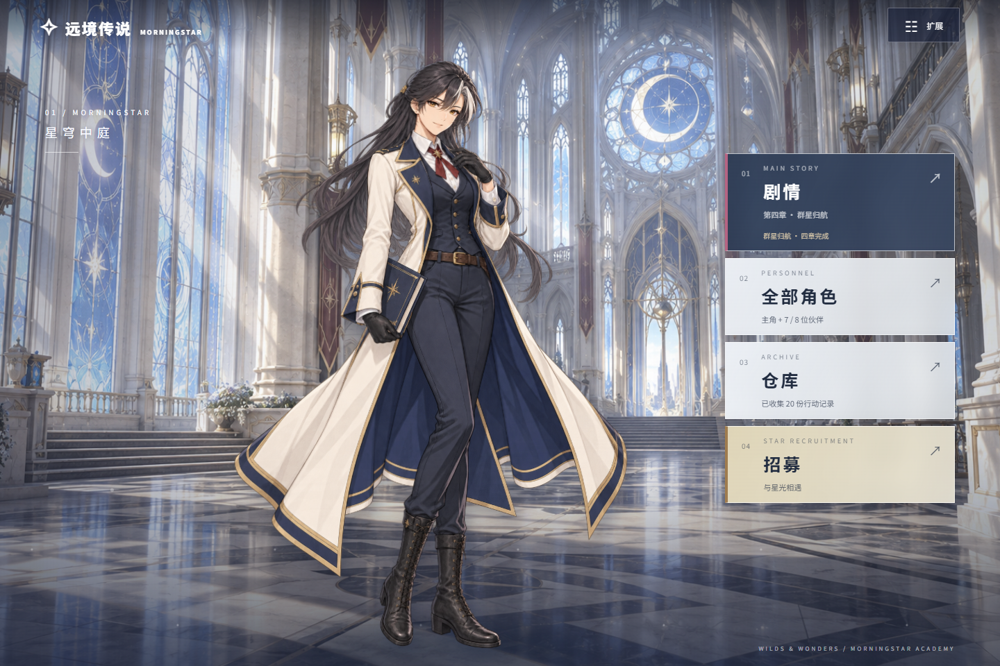
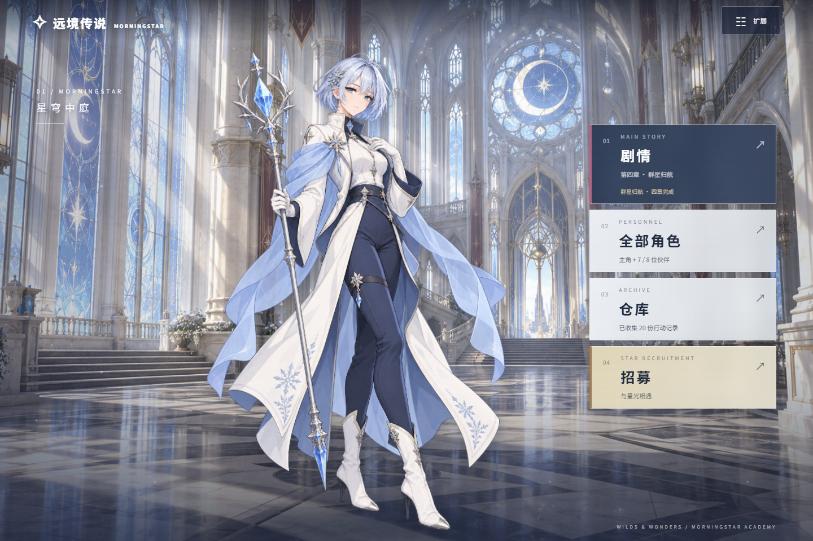
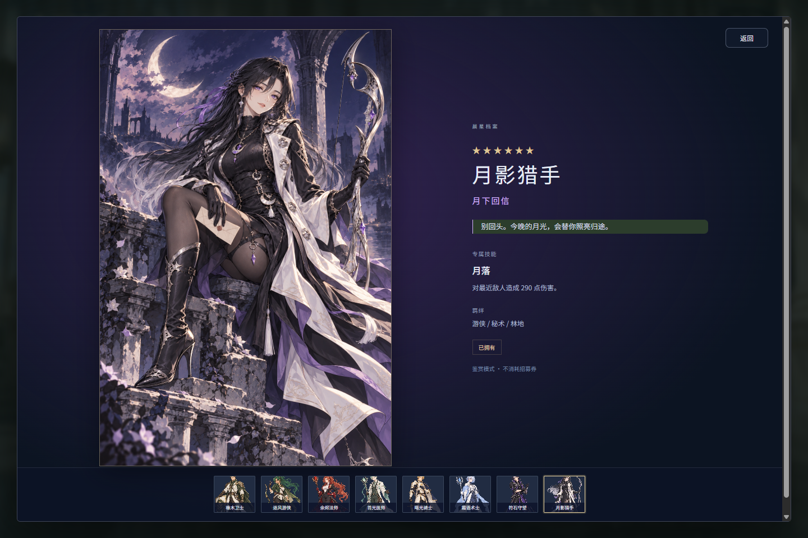

# 遠境伝説 / 远境传说 — Wilds & Wonders

Windows 向けの冒険オートチェス Demo。**v0.9.0** では、仲間 8 人と男女主人公の計 10 枚の立ち絵を作り直し、4 枚のテーマ付きカードイラスト、カードを 1 枚ずつ開く召喚演出、無料のカード鑑賞を追加しました。全 4 章・20 ステージを、立ち絵付き会話、オートチェス、タワーディフェンスで進めます。

**対応言語：简体中文 / English / 日本語。** アカウントとセーブデータは PC 内のローカルサーバーで管理します。課金機能はありません。

## ダウンロードと起動

- [Windows x64 版 ZIP](https://github.com/ride0612/wilds-and-wonders/releases/download/v0.9.0/WildsAndWonders-Windows-x64.zip)
- [ソースコードと実行ファイルを含む完全版 ZIP](https://github.com/ride0612/wilds-and-wonders/releases/download/v0.9.0/WildsAndWonders-Complete-Project.zip)
- [v0.9.0 リリースページ](https://github.com/ride0612/wilds-and-wonders/releases/tag/v0.9.0)

ZIP をすべて展開して **WildsAndWonders.exe** を起動してください。同じフォルダーの DLL、game、runtime、server は必要です。Windows 10 / 11 x64、.NET Framework 4.6.2 以降、Microsoft Edge WebView2 Runtime に対応しています。Node.js は同梱されているため、別途インストールは不要です。

アプリは 127.0.0.1:18765 のローカルサーバーを起動、または既存の同じバージョンに接続します。サーバー起動後はブラウザーから http://127.0.0.1:18765 でも遊べます。HTML ファイルを直接開かず、アプリまたはローカル URL を使用してください。必要な実行環境がそろっていれば、ゲームとアカウントはオフラインで利用できます。

ソース一式内の実行ファイルは release/WildsAndWonders-v0.9/WildsAndWonders.exe、配布用 ZIP は release/WildsAndWonders-Windows-x64.zip と release/WildsAndWonders-Complete-Project.zip です。ローカルでビルドしただけでは GitHub のリリースは更新されません。

## スクリーンショット

## v0.9.0 のビジュアル更新

- 仲間 8 人と男女主人公の計 10 枚の立ち絵を更新。線の強弱、まとまりのある影、控えめなハイライトを使い、表情とポーズの違いを重視しました。主人公 2 人の服装は共通のデザインです。
- 月影猎手、曙光骑士、霜语术士、余烬法师に、それぞれの物語を表すカードイラストを追加。他の仲間にも立ち絵と専用カード枠を組み合わせています。
- 召喚後はカードの裏面から 1 枚ずつ結果を開きます。六星には専用演出があり、いつでも全結果の表示へスキップできます。
- 「カード鑑賞」では未所持を含む全 8 人を無料で閲覧できます。チケットは消費せず、キャラクターの所持状態も変えません。結果画面のカードからも拡大表示できます。
- 新しい画面は 3 言語に対応。演出をオフにした場合、または OS の動きを減らす設定が有効な場合は、召喚結果を直接表示します。

立ち絵とカードイラストは **imagegen で生成した素材**です。画家による手描き原画やコラボ作品として扱っていません。公式作品の構図、配色、線、シルエットを観察し、ゲーム独自のキャラクターに適用しました。参考作品そのものは配布物に含めていません。出典と観察内容は [ビジュアル参考資料](assets/cards/REFERENCES.md)、生成方法とプロンプトは [アートディレクション](assets/cards/ART-DIRECTION.md) に記録しています。

## アカウントとロビー

登録またはログイン後に男女主人公を選び、名前を付けます。選択した姿と名前が会話に登場します。主人公はストーリー上の分身であり、5 人の戦闘枠は使いません。

新規アカウントには **橡木卫士・逐风游侠の 2 人と召喚チケット 60 枚**を配布します。保存済みの旧アカウントは、以前から開放されていた 8 人を引き継ぎます。登録時に旧ローカル進行を取り込むこともでき、元のセーブは削除しません。

ロビーには選択中のキャラクターを表示し、左側の名前・レアリティ・紹介は省いています。右側は「ストーリー」「召喚」「全キャラクター」「倉庫」の 4 入口です。「拡張」には言語、主人公、ストーリー回想、ガイド、立ち絵の動き、スキル演出、音楽、アカウント設定をまとめています。

全キャラクター画面では資料と所持状態を確認できます。所持する仲間をロビーに選んでも、主人公や編成は変わりません。未所持キャラクターは出撃やロビー展示に使えません。オンライン公開サーバー、パスワード再発行、マルチプレイは未実装です。

## 召喚・保証・装備

キャラクターと武器に、それぞれ限定・恒常の計 4 プールがあります。単発と 10 回召喚、チケット残高、保証カウント、収録内容、直近 100 件の履歴を確認できます。現在は終了期限を設けていないテスト用プールです。

| プール | 六星 | 五星 / 四星 |
| --- | --- | --- |
| 月下回信・限定キャラクター | 月影猎手 | 五星の仲間 4 人 / 初期の仲間 2 人 |
| 晨星同行・恒常キャラクター | 曙光骑士 | 五星の仲間 4 人 / 初期の仲間 2 人 |
| 弦月遗音・限定武器 | 弦月遗音 | 五星武器 3 種 / 四星武器 2 種 |
| 晨星军械・恒常武器 | 黎明誓约 | 五星武器 3 種 / 四星武器 2 種 |

- 基本確率は **六星 2%、五星 8%、四星 90%**。今回のビジュアル更新で確率は変えていません。
- 各プールで別々に計算し、**60 回以内に六星、10 回以内に五星以上**を保証します。六星で両方のカウントをリセットし、五星では 10 回保証だけをリセット。同時に条件へ達した場合は六星を優先します。
- 限定プールの六星は表示中の対象が必ず排出されます。50/50 はなく、恒常プールに限定六星は含まれません。プール間で保証回数を移すことはできません。
- 重複した四星 / 五星 / 六星は **10 / 50 / 200 の星塵**に変換。星塵 100 でチケット 1 枚と交換できます。
- 初期 60 枚に加え、20 ステージの各初回クリアで 10 枚ずつ獲得できます。同じステージを繰り返しても再配布しません。
- 結果、所持物、残高、保証はサーバー側で保存します。接続が切れた場合は前回の結果を確認でき、同一リクエストで二重消費しません。鑑賞、カードを開く操作、演出スキップも追加消費しません。

倉庫では武器、基本外観、ストーリー記念品を管理します。仲間 1 人につき武器 1 本を装備でき、同じ武器を同時に 2 人へ渡すことはできません。譲渡時は元の使用者から自動で外します。武器は攻撃力とスキル強度を上げ、重複武器は星塵になります。準備画面で装備を変更してください。

## 全 4 章・20 ステージ

秘密の学院、竜の血にまつわる謎、行方不明の父親、仲間との選択を描くオリジナルストーリーです。人物・出来事・台詞は独自のものです。**戦闘前後の計 40 シーン**に、3 言語の会話と立ち絵を用意しています。

| 章 | ステージ | オートチェス | タワーディフェンス |
| --- | --- | --- | --- |
| 第一章・赤潮来信 | 1–5 | 雨夜车站、沉没档案馆、海底钟楼 | 观测站夜袭、黎明撤离线 |
| 第二章・借来的明天 | 6–10 | 北行夜车、白钟旧市街、第十三声钟 | 雪线中继站、无钟之夜 |
| 第三章・无名者之庭 | 11–15 | 返校封锁令、空白毕业册、镜中委员会 | 医务翼的灯、广播室攻防 |
| 第四章・群星归航 | 16–20 | 雾海出航、记忆之海、写给黎明的回信 | 灯塔候潮室、群星归航线 |

章は順番に開放され、各章の最終ステージがボス戦です。会話、編成、戦闘、戦後会話を章の画面内で進めます。リアルタイムの 2D カメラ、2 人の立ち絵、話者の強調、文字送りを使用し、既存の背景 5 枚を各シーンに配置しています。ボイスや事前レンダリング動画はありません。

台詞または「次へ」を押すと全文が表示され、もう一度押すと進みます。前の台詞、自動送り、スキップ、言語切り替えに対応。シーンのスキップでは戦闘を飛ばせません。「拡張」の回想は進行状況を変えず、20 ステージ終了後も開放済みステージを遊べます。

## 戦闘とスキル

所持する仲間から最大 5 人を選択し、味方マスへドラッグして配置を入れ替えます。遠征はオートチェスで、下半分に配置した後は自動で索敵・移動・通常攻撃・スキルを行います。敵を全滅させると勝利です。

襲撃への防衛はタワーディフェンスです。青い防衛台に配置した仲間はその場にとどまり、コアに近い敵を優先します。敵が 1 体通過すると耐久が 18 減り、コアが 0 になるか全員倒れると敗北します。2 モードの配置は別々に記憶します。

通常攻撃でマナが 25 回復し、100 になるとダメージ・回復・範囲攻撃・シールドのスキルを自動発動します。各仲間には 2～3 種の特性があり、同じ特性を持つ異なる仲間を 2 / 3 人そろえると強化されます。特性は陣営ごとに集計します。

| 仲間 | 盤面のスキルエフェクト |
| --- | --- |
| 橡木卫士 | 成長する根と葉のシールド |
| 逐风游侠 | 風の矢と広がる風の輪 |
| 余烬法师 | 流星の炎と爆発の輪 |
| 苔光医师 | 回転する花びらと回復紋 |
| 霜语术士 | 六方向の氷晶と霜のひび |
| 符石守望 | 六角形のシールドとルーン |
| 曙光骑士・六星 | 金色の剣閃と多層の光輪 |
| 月影猎手・六星 | 三日月の軌跡と紫の星光 |

六星は盤面の演出が華やかになり、各陣営・各戦闘でそのキャラクターが初めてスキルを使う際に、**3.2 秒の全画面立ち絵演出**を 1 回再生します。複数人が発動した場合は順番に再生します。後続ウェーブやロビーへの往復では回数を戻さず、再編成して戦闘を始めたときにリセットします。演出をオフにしてもスキルの効果は変わりません。

戦闘中は左の特性欄と中央の盤面を中心に表示し、一時停止・速度・戻る操作を盤面内に置きます。盤面は斜め見下ろしの Canvas と SD キャラクターで、陣営リング、HP、マナを表示します。各ステージ開始時に状態を回復し、敗北時は再挑戦できます。2 倍速に対応し、オートチェスは 120 秒、防衛は 180 秒で時間切れです。ロビーや章選択へ戻ると一時停止します。昇星システムはありません。

## 音楽

ロビー、4 章のストーリー、オートチェス、防衛、ボス戦に使う計 8 曲を収録しています。最初のクリックまたはキー操作で再生を開始し、場面に合わせてフェードで切り替えます。「拡張」でオン・オフと音量を調整でき、バックグラウンドでは停止します。

曲は独自の音符配置とコードによる音声合成で制作し、ピアノ・鐘・弦・打楽器を模したループ WAV として出力しています。生演奏、実録オーケストラ、音楽生成モデルによる音声ではありません。既存の小説・アニメ・ゲームの楽曲は使用していません。[曲目と再生成方法](assets/music/README.md) を参照してください。

## セーブデータ

データベースは %LOCALAPPDATA%/WildsAndWonders/Server/accounts.sqlite に保存されます。名前、主人公、言語、展示キャラクター、編成、進行、所持物、残高、保証をアカウント別に管理します。更新時に既存アカウントを削除しません。

サーバーはローカル PC だけで待ち受け、ウィンドウを閉じた後も動作します。PC の再起動で停止し、次にゲームを開くと再起動します。「拡張」で保存状態の確認、再試行、ログアウトができます。アプリを閉じるときも保存完了を待ち、失敗した場合は通知します。

進行中の戦闘そのものは保存せず、次回は準備画面へ戻ります。勝利済みで戦後会話が未読なら、勝利状態から再開します。旧 WebView2 セーブとアカウント別キャッシュは %LOCALAPPDATA%/WildsAndWonders/WebView2 にあります。バックアップ、移行、API、ソースからの起動は [サーバー説明](server/README.md) を参照してください。アカウントデータベースやテスト用プロファイルを公開・配布しないでください。

## ビルドと検証

ソースからのビルドには Windows、Node.js 24 以降、システムの .NET Framework コンパイラーが必要です。プロジェクトのルートで実行します。

~~~powershell
./build.ps1 -OutputFolder release/WildsAndWonders-v0.9
~~~

初回は Microsoft WebView2 SDK を取得し、以降は .build のキャッシュを使います。Windows アプリ用フォルダーと ZIP を生成します。ソースを含む完全版 ZIP は別途パッケージ化します。

~~~powershell
node test.cjs
node server/test.cjs
node server/gacha-test.cjs
node server/client-races-test.cjs
./release/WildsAndWonders-v0.9/WildsAndWonders.exe --smoke-test
~~~

テストは戦闘、3 言語のシナリオ、初期 2 人の第 1 戦、保証でそろう最小編成での 80 戦、アカウントと保存、確率の境界、10 / 60 回保証、リトライ時の二重消費防止、4 プールの分離、初回報酬、武器の排他装備と永続化を対象にしています。アカウント切り替え後の遅延応答と音楽の復帰も確認します。

デスクトップテストは独立した 18767 ポートとテストデータベースを使い、プレイヤーのアカウントには接触しません。WebView2 の実画面でストーリー、召喚、鑑賞、画像と音楽の読み込みを確認し、スクリーンショットを保存します。

## 主なファイル

| パス | 内容 |
| --- | --- |
| index.html、各 .css | ロビー、戦闘、会話、アカウント、召喚の画面 |
| game.js、defense.js、arena.js | 戦闘シミュレーション、防衛、盤面描画 |
| characters.js、skill-fx.js | レアリティ、素材、キャラクター別エフェクト |
| gacha-data.js、gacha.js、gacha.css | 4 プール、武器、召喚演出、鑑賞、倉庫 |
| server/gacha.cjs | 抽選、所持物、保証、報酬、装備のトランザクション |
| story.js、campaign.js、campaign-expansion.js | 20 ステージのシナリオと章の開放 |
| cinematics.js、protagonist.js | 立ち絵付き会話と男女主人公 |
| presentation.js、lobby.js | ロビー、倉庫、六星演出、表示と保存 |
| music.js、assets/music/compose.cjs | BGM の切り替えと再生成可能な音楽合成 |
| localization.js、combat-text.js | 中国語・英語・日本語の基本テキスト |
| account.js、server/server.cjs | アカウント同期とローカル HTTP / SQLite |
| desktop/Program.cs | Windows 起動処理、サーバー確認、テスト入口 |
| test.cjs、server/*test.cjs | 戦闘、アカウント、召喚、非同期処理のテスト |
| desktop/account-smoke.js、desktop/smoke-v8.js | 実画面を使うフローテスト |
| assets/cards/REFERENCES.md、assets/cards/ART-DIRECTION.md | ビジュアル参考資料と生成プロンプト |
| assets/ART-DIRECTION.md、assets/CINEMATICS-ART.md、assets/PROTAGONIST-ART.md | 既存素材、背景、衣装の設計記録 |

現在は 2D 立ち絵の呼吸・揺れ・マウス追従と、戦闘用 SD スプライトを使用しています。自由回転する 3D モデルや Live2D のボーンは未実装です。キャラクター ID と外観 ID は分けてあり、今後レンダラーやスキンを拡張できます。基本的な武器装備以外に、ショップ、昇星、スキン解放システムはありません。

